  

  

  
  
  
  

  <b>4+ years</b> &nbsp;·&nbsp; <b>20+ projects</b> &nbsp;·&nbsp; <b>5 live apps</b>, 4 built from the first commit &nbsp;·&nbsp; 📍 Lahore, Pakistan &nbsp;·&nbsp; 🟢 Open to remote &amp; freelance

---

## 👋 About me

I help startups ship **fast, scalable iOS & Android apps**, from an empty repo to the App Store in weeks, not quarters. One React Native codebase, a truly native feel on both platforms.

- 📱 **Cross-platform apps**: React Native, TypeScript and Expo with Zustand / Redux Toolkit and TanStack Query. Clean architecture the next developer can actually pick up.
- 🔌 **The hard native bits**: push notifications, deep linking, maps and live location, Apple Pay & Google Pay, POS integrations and full Arabic/Urdu RTL. The integrations most projects get stuck on.
- 🚀 **Ship & iterate**: gated CI/CD with GitHub Actions and Expo EAS, Maestro end-to-end tests, semantic releases and OTA updates. Fixes reach users in hours.
- ⚡ **Performance & stability**: profiling slow screens, cutting startup time, crash reporting and analytics, so decisions come from data, not guesses.
- 🤖 **AI-assisted development**: Claude Code for features, refactoring, tests and docs, with automated AI review on every pull request.

> I care about apps that still feel fast on a mid-range Android phone, not just the latest iPhone.

---

## 🚀 Apps I've shipped

<table>
  <tr>
    <td width="72" align="center"></td>
    <td>
      <b>KiddieCove</b> &nbsp;<code>Built from scratch</code> 
      School management platform used by <b>500+ schools</b>: live bus tracking over MQTT, real-time chat, attendance and fees for parents, teachers and drivers. 
      React Native · TypeScript · Zustand · TanStack Query · Socket.IO · NestJS &nbsp;·&nbsp; <a href="https://kiddiecove.io/">Website</a>
    </td>
  </tr>
  <tr>
    <td align="center"></td>
    <td>
      <b>VemosPay</b> &nbsp;<code>Built from scratch</code> 
      QR-at-table payments for restaurants and bars: pay or split a live Toast POS check with Apple Pay or Google Pay, plus an iOS App Clip under 15 MB. 
      React Native · Expo · Redux Toolkit · Reanimated · Node.js &nbsp;·&nbsp; <a href="https://vemospay.com/">Website</a> · <a href="https://apps.apple.com/us/app/vemos-pay/id1521512947">App Store</a> · <a href="https://play.google.com/store/apps/details?id=com.vemos.vemospay">Google Play</a>
    </td>
  </tr>
  <tr>
    <td align="center"></td>
    <td>
      <b>A'men · UAE Media Council</b> &nbsp;<code>Built from scratch</code> 
      Government app for reporting misleading or unsafe media, with UAE Pass sign-in and a full Arabic right-to-left interface. 
      React Native · TypeScript · Redux Toolkit · RTK Query &nbsp;·&nbsp; <a href="https://amen.ae/">Website</a> · <a href="https://apps.apple.com/ae/app/amen/id6737225589">App Store</a> · <a href="https://play.google.com/store/apps/details?id=com.uaemediacouncil.amen">Google Play</a>
    </td>
  </tr>
  <tr>
    <td align="center"></td>
    <td>
      <b>Decant: Water Sort Puzzle</b> &nbsp;<code>Built from scratch</code> 
      Calm puzzle game with Skia-drawn graphics, seeded solver-verified levels, colorblind mode and fully offline play. 
      React Native · Expo · Skia · Reanimated · Next.js &nbsp;·&nbsp; <a href="https://play.google.com/store/apps/details?id=com.walqalum.decant">Google Play</a>
    </td>
  </tr>
  <tr>
    <td align="center"></td>
    <td>
      <b>GeoFace</b> &nbsp;<code>Joined mid-project</code> 
      Patented proof-of-presence app: a face scan, GPS location and timestamp sealed into a verifiable certificate, saved to Apple Wallet. 
      React Native · Redux · Google Maps · Apple Wallet · Express · MongoDB &nbsp;·&nbsp; <a href="https://geoface.com.au/">Website</a> · <a href="https://apps.apple.com/pk/app/geoface/id1602781941">App Store</a>
    </td>
  </tr>
</table>

<a href="https://ameer-hamza-rn.vercel.app/#projects"><b>See full case studies on my portfolio →</b></a>

---

## 🛠️ Tech stack

**Mobile** 

**State & data** 

**Backend & cloud** 

**Ship & quality** 

---

## 📊 GitHub stats

  
  

---

## 📫 Let's work together

Open to **remote roles** and **freelance projects** worldwide. Have an app in mind? I usually reply within a day.

📧 [ameer.hamza0070@gmail.com](mailto:ameer.hamza0070@gmail.com) &nbsp;·&nbsp; 💼 [LinkedIn](https://www.linkedin.com/in/ameer-hamza-02a155214) &nbsp;·&nbsp; 🌐 [ameer-hamza-rn.vercel.app](https://ameer-hamza-rn.vercel.app)

  

